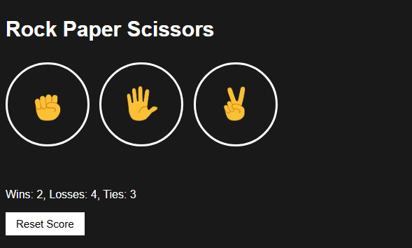

# Rock Paper Scissors Game

A simple interactive Rock Paper Scissors game built with JavaScript.  
The game keeps track of your wins, losses, and ties using the browser's local storage, allowing you to continue your game progress even after refreshing the page.

 <!-- Optional: Add a screenshot of your app -->

---

## Features

- Play Rock, Paper, or Scissors against the computer.
- Score tracking with wins, losses, and ties saved in `localStorage`.
- Play using buttons or keyboard shortcuts (`r` for rock, `p` for paper, `s` for scissors).
- Auto-play mode that plays a game every second automatically.
- Visual feedback with emojis representing player and computer moves.

---

## How to Play

1. Click the **Rock**, **Paper**, or **Scissors** button, or press the keyboard keys:
   - `r` for Rock
   - `p` for Paper
   - `s` for Scissors
2. The computer randomly selects a move.
3. The result (`You win`, `You lose`, or `Tie`) is displayed.
4. Your score updates and is saved in your browser’s local storage.
5. Click the **Auto Play** button to start or stop the game playing automatically every second.

---
## 🧾 HTML Structure for Rock Paper Scissors Game

Below is the `index.html` file that creates the structure of the game interface. It includes buttons for user input, sections for results and scores, and connects to the external JavaScript and CSS files.

```html
<!DOCTYPE html>
<html>

<head>
  <title>Rock Paper Scissors</title>
  <link rel="stylesheet" href="styles/rock-paper-scissors.css">
</head>

<body>
  <p class="title">Rock Paper Scissors</p>

  <!-- Player move buttons with emojis -->
  <button class="move-button js-rock-button">
    
  </button>

  <button class="move-button js-paper-button">
    
  </button>

  <button class="move-button js-scissors-button">
    
  </button>

  <!-- Result of the game -->
  <p class="js-result result"></p>

  <!-- Player and computer moves -->
  <p class="js-moves"></p>

  <!-- Scoreboard -->
  <p class="js-score score"></p>

  <!-- Reset and Auto Play controls -->
  <button onclick="
    score.wins = 0;
    score.losses = 0;
    score.ties = 0;
    localStorage.removeItem('score');
    updateScoreElement();
  " class="reset-score-button">Reset Score</button>

  <button class="auto-play-button js-auto-play-button">Auto Play</button>

  <!-- External JavaScript -->
  <script src="scripts/rock-paper-scissors.js"></script>
</body>

</html>
```
## ✊✋✌️ Rock Paper Scissors Game Logic (JavaScript)

This interactive game allows users to play Rock, Paper, Scissors against the computer. It includes score tracking, keyboard shortcuts, and an autoplay feature using `setInterval`.

```javascript
// Load saved score from localStorage or initialize to zero
let score = JSON.parse(localStorage.getItem("score")) || {
  wins: 0,
  losses: 0,
  ties: 0,
};

updateScoreElement(); // Display initial score

let isAutoPlaying = false;
let intervalId;

// Autoplay toggle button event
document.querySelector('.js-auto-play-button').addEventListener('click', () => {
  autoPlay();
});

// Automatically play a round every second
function autoPlay() {
  if (!isAutoPlaying) {
    intervalId = setInterval(() => {
      const playerMove = pickComputerMove(); // Let computer play both sides
      playGame(playerMove);
    }, 1000);
    isAutoPlaying = true;
  } else {
    clearInterval(intervalId);
    isAutoPlaying = false;
  }
}

// Button click events for user choice
document.querySelector('.js-rock.button').addEventListener('click', () => {
  playGame('rock');
});
document.querySelector('.js-paper.button').addEventListener('click', () => {
  playGame('paper');
});
document.querySelector('.js-scissors.button').addEventListener('click', () => {
  playGame('scissors');
});

// Keyboard shortcuts: R, P, S
document.body.addEventListener('keydown', (event) => {
  if (event.key === 'r') {
    playGame('rock');
  } else if (event.key === 'p') {
    playGame('paper');
  } else if (event.key === 's') {
    playGame('scissors');
  }
});

// Main game logic
function playGame(playerMove) {
  const computerMove = pickComputerMove(); // Random computer move
  let result = '';

  // Determine the winner
  if (playerMove === "scissors") {
    result = computerMove === "rock" ? "You lose" :
             computerMove === "paper" ? "You win" : "Tie";
  } else if (playerMove === "paper") {
    result = computerMove === "scissors" ? "You lose" :
             computerMove === "rock" ? "You win" : "Tie";
  } else if (playerMove === "rock") {
    result = computerMove === "paper" ? "You lose" :
             computerMove === "scissors" ? "You win" : "Tie";
  }

  // Update score
  if (result === "You win") {
    score.wins++;
  } else if (result === "You lose") {
    score.losses++;
  } else {
    score.ties++;
  }

  // Save and update score
  localStorage.setItem("score", JSON.stringify(score));
  updateScoreElement();

  // Display result and moves
  document.querySelector(".js-result").innerHTML = result;
  document.querySelector(".js-moves").innerHTML = `You
    
    
    Computer`;
}

// Display current score on the page
function updateScoreElement() {
  document.querySelector(".js-score").innerHTML =
    `Wins: ${score.wins}, Losses: ${score.losses}, Ties: ${score.ties}`;
}

// Randomly pick computer move
function pickComputerMove() {
  const randomNumber = Math.random(); // 0 to 1
  let computerMove = "";

  if (randomNumber < 1 / 3) {
    computerMove = "rock";
  } else if (randomNumber < 2 / 3) {
    computerMove = "paper";
  } else {
    computerMove = "scissors";
  }

  return computerMove;
}
```

## Usage

The main JavaScript logic is in `script.js`. Key functions include:

- `playGame(playerMove)`: Plays a round based on the player's move.
- `pickComputerMove()`: Randomly chooses the computer’s move.
- `updateScoreElement()`: Updates the score display on the page.
- Auto-play uses `setInterval` to repeatedly play rounds every second.

## How to Run Locally

1. Clone the repository:
   ```bash
   git clone https://github.com/YourUsername/rock-paper-scissors.git


## Rock Paper Scissors Game

Open `index.html` in your browser.

Enjoy playing!

---

## Technologies Used

- JavaScript (ES6)  
- HTML5  
- CSS3  
- Browser localStorage API  

---

## Future Improvements

- Add animations for moves.  
- Add multiplayer or online mode.  
- Improve UI/UX design.  
- Add sounds for interactions.  

## Author

Ellias Sithole 

